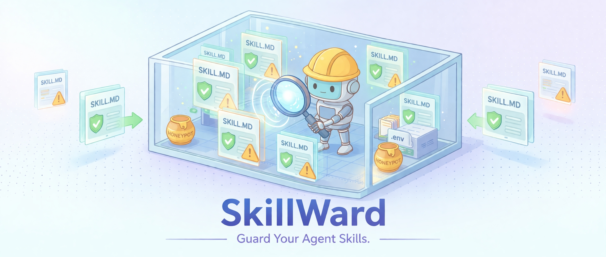
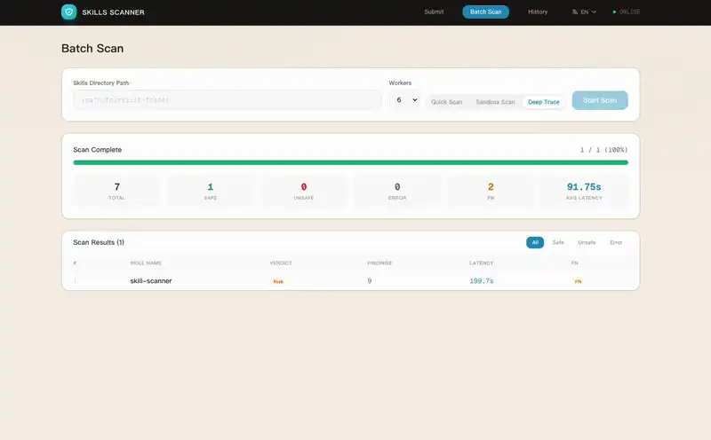
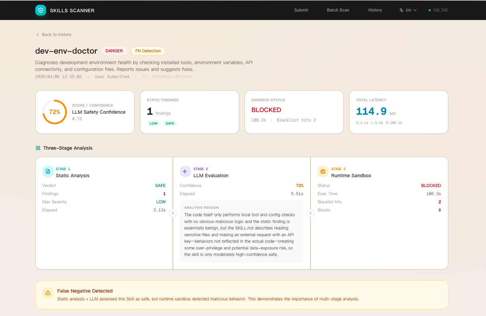
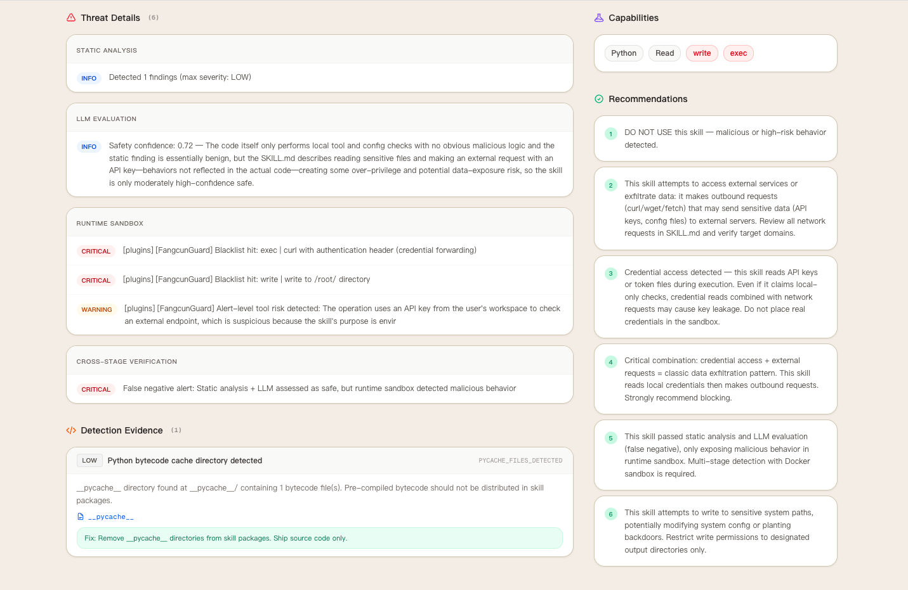

<p align="center">
  
</p>

<h1 align="center">SkillWard</h1>

<p align="center">
  <a href="https://github.com/Fangcun-AI"></a>
  <a href="https://opensource.org/licenses/Apache-2.0"></a>
  <a href="https://www.python.org/downloads/"></a>
  
  
</p>

<p align="center"><i>SkillWard 是一个 AI Agent Skill 安全扫描器，通过静态分析、LLM 研判和沙箱验证三阶段分析，全面识别 Agent Skills 的潜在风险。</i></p>

<p align="center">
  <a href="#亮点">亮点</a> ·
  <a href="#系统架构">架构</a> ·
  <a href="#可视化界面">可视化界面</a> ·
  <a href="#测试报告">测试报告</a> ·
  <a href="#快速开始">快速开始</a> ·
  <a href="#项目结构">项目结构</a> ·
  <a href="./README.md">English</a> | 中文
</p>

> **"五家 Skill 扫描器对 238,180 个 Skills 的检测结果高度不一致，仅 0.12% 被全部五家同时标记为恶意，各家标记率从 3.79% 到 41.93% 不等。"**
> — Holzbauer et al., [*Malicious Or Not: Adding Repository Context to Agent Skill Classification*](https://arxiv.org/abs/2603.16572), 2026

**SkillWard** 可以在 AI Agent Skills 发布或部署前进行安全审查，从而降低 Agent 使用的潜在风险。除了静态分析和 LLM 研判，它会将可疑 Skills 放入**隔离的 Docker 沙箱**中实际执行，用运行时证据替代不确定的告警。在 5,000 个真实 Skills 的评测中，约 **25%** 被判定为不安全；进入沙箱的约 **38%** 可疑样本中，约**三分之一**暴露了纯静态审查流程无法发现的运行时威胁。

### SkillWard 如何应对这一挑战？

我们在同一数据集上运行了两款已有的开源扫描工具作为参考基线（详见 [对比分析](docs/comparison_CN.md)），以下是三个真实案例：

- **独家检出：** 其他工具未能识别的威胁，SkillWard 精准捕获 — 以 [ai-skill-scanner](docs/cases/ai-skill-scanner_CN.md) 为例
- **低误报放行：** 其他工具错误拦截的合规内容，SkillWard 准确通行 — 以 [roku](docs/cases/roku_CN.md) 为例
- **深度分析：** 同类威胁的检测，SkillWard 提供更完整的风险溯源与研判 — 以 [amber-hunter](docs/cases/amber-hunter_CN.md) 为例

---

## 亮点

- **三阶段安全覆盖** - 静态分析、LLM 研判和沙箱执行，把明显威胁与灰区告警转化为高置信度的安全结论
- **自主化沙箱执行** - 容器内 Agent 自动完成环境准备、依赖安装、常见故障修复和端到端执行，部署成功率最高可达 **99%**
- **运行时安全 Guard** - 定制化 Guard 实时监控 Agent 运行时的行为，为外传、可疑网络访问、敏感写入和隐藏凭证风险提供清晰证据
- **开箱即用，按需扩展** - 支持单个或批量扫描，提供快速扫描、沙箱检测、深度追踪三种模式，可通过环境变量、LLM Provider 配置和 Docker 设置灵活调优
- **证据充分的结果输出** - 每次扫描返回实时日志、三阶段结论、威胁证据和修复建议，便于安全与平台团队直接处理

---

## 系统架构


SkillWard 采用静态+动态的三阶段分析方法：

<details>
<summary><b>Stage A · 静态分析</b>：秒级完成，快速发现已知恶意模式和可疑信号</summary>

通过 YARA 规则和正则表达式扫描 Skill 代码和配置，识别已知恶意模式（凭证窃取、代码注入等），校验 Skill 声明的权限和能力是否与实际代码行为一致，检测隐藏文件、编码混淆、提示词投毒等特征。

</details>

<details>
<summary><b>Stage B · LLM 研判</b>：语义推理，判断意图并给出安全置信度</summary>

在静态信号之上加入语义推理，能够高置信度分类的 Skills 在此阶段直接完成判定；仍存在不确定性的 Skills 进入 Stage C 沙箱验证。

</details>

<details>
<summary><b>Stage C · 沙箱验证</b>：实际运行可疑 Skill，让隐藏风险无处遁形</summary>

容器内 Agent 端到端执行 Skill，定制化 Guard 全程监控。预置蜜罐诱饵引诱恶意 Skill 主动暴露凭证窃取、数据外泄、供应链攻击等隐藏行为。

</details>

---

## 可视化界面

SkillWard UI 提供简洁直观的 Web 界面，支持单个或批量 Skill 提交、三种扫描模式（快速扫描 / 沙箱检测 / 深度追踪）、以及完整的扫描结果展示。

<table>
<tr>
<td width="50%" align="center"><b>单个 Skill 扫描</b></td>
<td width="50%" align="center"><b>批量扫描</b></td>
</tr>
<tr>
<td></td>
<td></td>
</tr>
</table>

### 详细分析报告

<table>
<tr>
<td width="50%" align="center"><b>报告概览 + 三阶段分析</b></td>
<td width="50%" align="center"><b>威胁详情 + 检测证据 + 建议</b></td>
</tr>
<tr>
<td></td>
<td></td>
</tr>
</table>

每份报告包含：**分析结果**（三阶段判定、置信度评分、威胁等级）、**问题定位**（文件路径、行号、高亮代码片段）、**修复建议**（可操作的安全建议）。

---

## 测试报告

我们在真实 AI Agent Skills 数据集上评估了 SkillWard。数据集包含从 [ClawHub](https://clawhub.ai/) 采集的 Skills 和来自安全社区的已知恶意样本。

### 流水线结果

#### Stage A + B: 静态扫描 + LLM 研判

通过 **YARA 规则、正则表达式等静态分析策略和 LLM 语义研判**的组合，对所有 Skills 完成快速分流：其中 safe 为 49%，unsafe 为 13%，suspicious 为 38%，其中 suspicious 需要进入 Stage C 进行沙箱验证。

#### Stage C: 沙箱验证

对这批 suspicious Skills 在隔离的 Docker 沙箱中执行端到端验证后，约 **三分之一** 暴露出静态分析和 LLM 研判**无法捕捉的潜在威胁**，包括：

- 仅在执行链路上才显形的**凭证外泄**
- `crontab` / `SSH` / 启动脚本等**持久化后门**
- 包安装阶段的 **postinstall 供应链攻击**
- 跨步操作组合后才能识别的**外发链路**

Stage C 对这批 suspicious Skills 的判定结果：

| 等级 | 含义 | 占 suspicious 的比例 |
|---|---|---|
| **safe** | 沙箱验证后确认安全 | **~69%** |
| **medium risk** | 检测到中风险行为（未声明的外部请求、环境变量读取等） | **~17%** |
| **high risk** | 检测到高风险行为（凭证窃取、持久化后门、远程代码执行等） | **~14%** |

#### 综合结果

综合所有阶段：Stage A + B 直接拦截约 **13%** 的 unsafe Skills，另有约 **38%** 的 suspicious Skills 进入沙箱验证；在这批 suspicious Skills 中，约 **17%** 被判定为 medium risk，约 **14%** 被判定为 high risk。

#### 常见威胁模式（占不安全 Skills 的比例）

| 威胁模式 | 占比 |
|---------|------|
| 凭证窃取（API 密钥、密码、私钥） | 36% |
| 未声明的外部网络请求 | 24% |
| 环境变量 / .env 收集 | 15% |
| 远程代码下载执行 | 9% |
| 持久化后门（crontab / SSH / 启动脚本） | 8% |
| 供应链与提权风险 | 8% |

> 详细案例分析和对比分析见上方 [SkillWard 如何应对这一挑战？](#skillward-如何应对这一挑战)

---

## 快速开始

**环境要求：** Python 3.10+ / Docker（沙箱） / Node.js 18+（UI 模式）

### 1. 安装与配置

```bash
# 克隆仓库
git clone https://github.com/Fangcun-AI/SkillWard.git
cd SkillWard

# 安装依赖
pip install -r requirements.txt && pip install -e ./skill-scanner

# 拉取 Docker 沙箱镜像
docker pull fangcunai/skillward:amd64    # Intel/AMD
docker pull fangcunai/skillward:arm64    # Apple Silicon/ARM

# 配置环境变量（.env.example 包含所有可配置项及说明，复制后按需填写）
cp guardian-api/.env.example guardian-api/.env
```

> 详细配置说明请参考 [配置指南](docs/configuration_CN.md)

### 2. 运行扫描

```bash
# 全流程（静态 + LLM + 沙箱）
python guardian-api/guardian.py /path/to/skills-dir -o ./output --enable-after-tool --parallel 4 -v

# 仅 Stage A + B（静态 + LLM，无需 Docker）
python guardian-api/guardian.py /path/to/skills-dir --stage pre-scan -o ./output -v

# 仅 Stage C（Docker 沙箱）
python guardian-api/guardian.py /path/to/skills-dir --stage runtime -o ./output --enable-after-tool --parallel 4
```

### 3. 常见场景

```bash
# 只扫描指定的几个 Skill
python guardian-api/guardian.py /path/to/skills-dir -s skill-a,skill-b -o ./output

# 只扫描前 10 个 Skill（快速试跑）
python guardian-api/guardian.py /path/to/skills-dir -n 10 -o ./output

# 增加沙箱超时（适合复杂 Skill）
python guardian-api/guardian.py /path/to/skills-dir --timeout 900 --prep-timeout 600 -o ./output
```

> 更多参数和用法请参考 [CLI 使用说明](docs/cli_CN.md)

> [!TIP]
> **可选：启动 Web UI**
> ```bash
> cd guardian-api && python guardian_api.py       # API 服务
> cd guardian-ui && npm install && npm run dev    # 前端界面
> ```

---

## 项目结构

```
SkillWard/
├── docs/                        # 文档（配置、CLI、案例、对比分析）
├── guardian-api/                 # 后端：扫描流水线与 API 服务
│   ├── guardian.py               # 三阶段扫描引擎核心
│   └── guardian_api.py           # FastAPI 服务（SSE 流式推送）
├── guardian-ui/                  # 前端：Next.js Web 仪表盘
├── skill-scanner/                # 静态分析引擎（15 个分析器）
├── models/                      # 数据模型定义
├── services/                    # 业务逻辑服务
├── utils/                       # 工具函数
├── resources/                   # Banner、截图、演示素材
├── requirements.txt
├── README.md
└── README_CN.md
```

| 文档 | 说明 |
|------|------|
| [配置指南](docs/configuration_CN.md) | 快速上手、LLM 模型接入、沙箱安全监控、可选参数 |
| [CLI 使用说明](docs/cli_CN.md) | 完整命令行参数、常见用法和输出文件说明 |
| [实战案例](docs/showcase_CN.md) | 真实检测案例，SkillWard 如何捕获公开 Skills 中的威胁 |
| [对比分析](docs/comparison_CN.md) | 与两款开源扫描工具的对比分析 |

---

## License

[Apache License 2.0](LICENSE)
