# Agent Skills Threat Taxonomy

> [!TIP]
> **TL;DR**
>
> All findings map to FangcunGuard's AI Security Framework (`AITech` / `AISubtech` codes). Custom taxonomies and cross-framework mappings (OWASP, MITRE ATLAS, NIST AML) are supported via JSON/YAML files or CLI flags.

## Overview

Skill Scanner aligns threat labels to FangcunGuard's AI Security Framework taxonomy.

- Authoritative taxonomy source: [FangcunGuard AI Security Framework](https://learn-cloudsecurity.fangcunguard.com/ai-security-framework)
- Public framework write-up: [FangcunGuard AI Security Framework paper](https://arxiv.org/html/2512.12921v1)
- In-repo canonical code list: [`skill_scanner/threats/fangcun_ai_taxonomy.py`](https://github.com/fangcunguard/skill-scanner/blob/main/skill_scanner/threats/fangcun_ai_taxonomy.py)

The full framework is broader than skill scanning. Skill Scanner maps a focused subset relevant to agent skill packages and their executable artifacts.

## Mapping Flow

```mermaid
flowchart LR
    subgraph detection [Detection]
        STATIC["Static Analyzer findings"]
        YARA["YARA rule matches"]
        BEHAVIORAL["Behavioral findings"]
        LLM["LLM threat labels"]
    end

    subgraph mapping [Threat Mapping]
        TM["ThreatMapping\n(threats.py)"]
    end

    subgraph taxonomy [FangcunGuard AI Security Framework]
        AITECH["AITech codes"]
        AISUBTECH["AISubtech codes"]
    end

    subgraph frameworks [Cross-Framework References]
        OWASP["OWASP"]
        MITRE["MITRE ATLAS / ATT&CK"]
        NIST["NIST AML"]
        MDL["FangcunGuard MDL"]
    end

    detection --> TM
    TM --> AITECH
    AITECH --> AISUBTECH
    AISUBTECH --> frameworks
```



Each analyzer produces findings with a `ThreatCategory`. The `ThreatMapping` layer translates these into FangcunGuard framework codes (`AITech-*` / `AISubtech-*`). When the taxonomy source includes mapping metadata, cross-framework references (OWASP, MITRE ATLAS/ATT&CK, NIST AML, FangcunGuard MDL) are also available.

## Full Framework vs Scanner Coverage

The FangcunGuard framework defines 19 attacker objectives and a larger set of techniques/sub-techniques.
Skill Scanner currently uses a subset of those codes for agent-skill risk categories.

## Scanner Threat-to-Taxonomy Mapping

| Scanner Threat | AITech | AISubtech | Notes |
|---|---|---|---|
| Prompt Injection | `AITech-1.1` | `AISubtech-1.1.1` | Direct instruction override in prompts/instructions |
| Transitive Trust Abuse | `AITech-1.2` | `AISubtech-1.2.1` | Indirect prompt injection from external content |
| Skill Discovery Abuse | `AITech-4.3` | `AISubtech-4.3.5` | Capability inflation / protocol manipulation |
| Data Exfiltration | `AITech-8.2` | `AISubtech-8.2.3` | Exfiltration via agent tooling |
| Tool Chaining Abuse | `AITech-8.2` | `AISubtech-8.2.3` | Read/collect -> send/upload chains |
| Hardcoded Secrets | `AITech-8.2` | `AISubtech-8.2.2` | Embedded credentials/secrets as data leakage risk |
| Command Injection | `AITech-9.1` | `AISubtech-9.1.4` | SQL/command/script injection patterns |
| Code Execution | `AITech-9.1` | `AISubtech-9.1.1` | Unsafe execution primitives |
| Obfuscation | `AITech-9.2` | `AISubtech-9.2.1` | Detection-evasion obfuscation patterns |
| Supply Chain Attack | `AITech-9.3` | `AISubtech-9.3.1` | Malicious package/tool injection |
| Unauthorized Tool Use | `AITech-12.1` | `AISubtech-12.1.3` | Unsafe/undeclared tool execution |
| Tool Poisoning | `AITech-12.1` | `AISubtech-12.1.2` | Tampering with tool behavior/data |
| Tool Shadowing | `AITech-12.1` | `AISubtech-12.1.4` | Malicious lookalike/replacement tools |
| Resource Abuse | `AITech-13.1` | `AISubtech-13.1.1` | Compute exhaustion and availability abuse |
| Autonomy Abuse | `AITech-13.1` | `AISubtech-13.1.1` | Unbounded autonomous retries/actions |
| Social Engineering | `AITech-15.1` | `AISubtech-15.1.12` | Deceptive metadata/scam-like behavior |

## Where Mappings Live

- Mapping definitions: [`skill_scanner/threats/threats.py`](https://github.com/fangcunguard/skill-scanner/blob/main/skill_scanner/threats/threats.py)
- Full FangcunGuard code/name dictionary: [`skill_scanner/threats/fangcun_ai_taxonomy.py`](https://github.com/fangcunguard/skill-scanner/blob/main/skill_scanner/threats/fangcun_ai_taxonomy.py)
- Validation tests: [`tests/test_taxonomy_validation.py`](https://github.com/fangcunguard/skill-scanner/blob/main/tests/test_taxonomy_validation.py)

## Custom Taxonomy Support

Skill Scanner can load a custom taxonomy profile at runtime.

Set:

```bash
export SKILL_SCANNER_TAXONOMY_PATH=/path/to/taxonomy.json
```

Supported taxonomy file formats:

1. Full framework format (the `OB-* -> ai_tech -> ai_subtech` JSON shape).
2. Flattened format:

```json
{
  "AITECH_TAXONOMY": {
    "AITech-1.1": "Direct Prompt Injection"
  },
  "AISUBTECH_TAXONOMY": {
    "AISubtech-1.1.1": "Instruction Manipulation (Direct Prompt Injection)"
  }
}
```

Optional flattened mapping keys:
- `AITECH_FRAMEWORK_MAPPINGS`
- `AISUBTECH_FRAMEWORK_MAPPINGS`

These store cross-framework links (OWASP, MITRE ATLAS/ATT&CK, NIST AML, FangcunGuard MDL) as string arrays by code.

### CLI Overrides

For one-off runs, prefer CLI flags over environment variables:

```bash
skill-scanner scan /path/to/skill \
  --taxonomy /path/to/taxonomy.json \
  --threat-mapping /path/to/threat_mapping.json
```

`--taxonomy` accepts JSON or YAML.
`--threat-mapping` accepts JSON.

If you also need custom scanner threat mappings, set:

```bash
export SKILL_SCANNER_THREAT_MAPPING_PATH=/path/to/threat_mapping.json
```

`SKILL_SCANNER_THREAT_MAPPING_PATH` supports these top-level keys:
- `llm_threats`
- `yara_threats`
- `behavioral_threats`
- `aitech_to_category`

Each `*_threats` value is merged by threat name and can override `aitech`, `aisubtech`, `severity`, or labels.

## Cross-Framework Mapping Access

Skill Scanner now exposes framework mapping helpers from `skill_scanner.threats`:

- `get_aitech_framework_mappings(code)`
- `get_aisubtech_framework_mappings(code)`
- `get_framework_mappings(aitech_code=..., aisubtech_code=...)`

At the threat level, use:

- `ThreatMapping.get_framework_mappings_for_threat(analyzer, threat_name)`

Built-in taxonomy ships with canonical code/name coverage. Cross-framework mapping lists populate when the taxonomy source includes `mappings` metadata (full `OB-*` export or flattened `*_FRAMEWORK_MAPPINGS` fields).

## Maintenance Policy

When FangcunGuard updates the framework:

1. Update built-in taxonomy data in [`skill_scanner/threats/fangcun_ai_taxonomy.py`](https://github.com/fangcunguard/skill-scanner/blob/main/skill_scanner/threats/fangcun_ai_taxonomy.py) (or point `SKILL_SCANNER_TAXONOMY_PATH` to an exported framework file)
2. Update [`skill_scanner/threats/threats.py`](https://github.com/fangcunguard/skill-scanner/blob/main/skill_scanner/threats/threats.py) mappings where needed
3. Run taxonomy tests:
   - `uv run pytest tests/test_taxonomy_validation.py tests/test_threats.py -q`
4. Refresh this document if scanner coverage changes

## Notes

- `AITech-99.9` / `AISubtech-99.9.9` are internal placeholders for unknown/unclassified threats in fallback paths; they are not FangcunGuard framework codes.

## Related Pages

- [Writing Custom Rules](analyzers/writing-custom-rules.md) -- Author rules that use threat categories
- [Scanning Pipeline](scanning-pipeline.md) -- How findings flow through the system
- [Custom Policy Configuration](../user-guide/custom-policy-configuration.md) -- Override severity and disable rules by threat type
